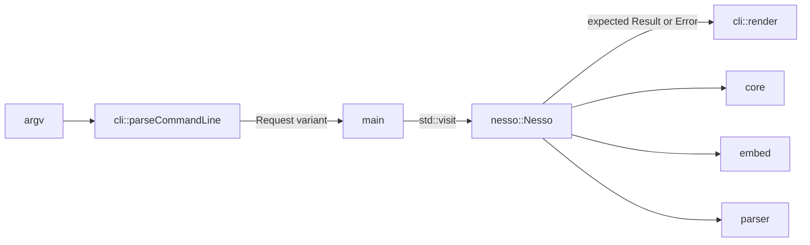

# Nesso

**Local semantic search for unstructured text** (C++26)

by **Lorenzo Caprari**

Nesso is a Linux-native CLI for searching local text by meaning.

## Today

- `nesso grep QUERY FILE...` — one-shot semantic search over `.log`, `.json`, and `.jsonl`
- `nesso index` / `nesso search` — persist that text and its embeddings, then search the file
- `nesso store init` / `index` / `search` — raw float32 vector store (mmap, cosine top-k)
- Local ONNX MiniLM embedder. Ranking is a brute-force scan (no ANN index yet)
- Conan 2 toolchain with ASan/UBSan debug builds and CI coverage gates

## Non-goals

- Not a hosted vector database (Qdrant, pgvector, etc.)
- No approximate nearest-neighbor index yet
- Linux only (POSIX `mmap`)

## Install

Ubuntu 26.04+, from a GitHub Release `.deb`:

```bash
sudo apt install ./nesso_*_amd64.deb
nesso grep "database connection error" app.log
```

The package ships the MiniLM files in `/usr/share/nesso`. An omitted `--model-dir` uses `NESSO_MODEL_DIR`, then `./models` when both files are present, then `$XDG_DATA_HOME/nesso` (or `~/.local/share/nesso`), then `/usr/share/nesso`.

Anywhere with Docker:

```bash
docker pull ghcr.io/lorenzocaprari/nesso:latest
docker run --rm -v "$PWD:/data" -w /data ghcr.io/lorenzocaprari/nesso:latest \
  grep "database connection error" app.log
```

Push a `vX.Y.Z` tag that matches `version` in `conanfile.py` to publish the image, the `.deb`, and the GitHub Release. CI must already have published `nesso-build-env`.

## Prerequisites

- **Compiler:** GCC 15+ with C++26 support
- **Build system:** CMake 3.28+
- **Package manager:** Conan 2.x
- **OS:** Linux

## Build

```bash
conan install . -pr:h ./conan/profiles/gcc-26-debug -pr:b default \
  --lockfile=conan.lock --build=missing
conan build . -pr:h ./conan/profiles/gcc-26-debug -pr:b default \
  --lockfile=conan.lock --build=missing
ctest --test-dir build/Debug --output-on-failure
```

Release profile: replace `gcc-26-debug` with `gcc-26`.

## Usage

Download the embedding model once:

```bash
./scripts/fetch-model
```

Search files by meaning. `-k` is optional (default 5):

```bash
./build/Debug/nesso grep "database connection error" app.log
./build/Debug/nesso grep "payment timeout" app.log events.jsonl dump.json -k 5
./build/Debug/nesso grep "auth failure" app.log --model-dir models/
```

Index the same files once, then search the corpus. `-o` and `-i` are required:

```bash
./build/Debug/nesso index -o corpus.nesso app.log events.jsonl
./build/Debug/nesso search "payment timeout" -i corpus.nesso -k 5
```

Matches go to stdout. Skipped lines, the index summary, and errors go to stderr. Search exits 1 when nothing matches.

### File limits

- Formats: `.log`, `.json`, `.jsonl` only (by extension). Directories and other files are rejected.
- `.log`: one chunk per non-empty line; lines longer than 4096 characters are skipped.
- `.json` / `.jsonl`: only objects with a string `message` field are indexed; malformed lines/documents are skipped.
- `grep` holds the whole corpus in memory for that invocation. `index` writes it to the corpus file; `search` loads that file back into memory. Very large files will be slow and RAM-heavy.
- Lines longer than 4096 characters, empty lines, and JSON values without a string `message` are skipped. A skip count is printed on stderr.

## Vector store

Initialize a database container, ingest raw float32 vectors, and search by cosine similarity:

```bash
./build/Debug/nesso store -p vectors.nesso -d 128 init
./build/Debug/nesso store -p vectors.nesso -d 128 index -f vectors.bin
./build/Debug/nesso store -p vectors.nesso -d 128 search -q query.bin -k 10
```

Each record in `vectors.bin` / `query.bin` is `dimensions * sizeof(float)` bytes.

## Architecture



- `src/cli/` owns the command line. `cli_parser.cpp` turns argv into one typed request, `execute.cpp` calls the matching `nesso::Nesso` method, and `output.cpp` writes every stdout and stderr line.
- `src/lib/` builds `libnesso`. `nesso/nesso.hpp` is its public API: plain request and result types, a structured `nesso::Error`, and no I/O to the terminal. Its dependencies stay private, so a consumer never sees ONNX or mmap headers.
- `src/core`, `src/embed`, and `src/parser` hold storage and search, the MiniLM embedder, and the log and JSON chunker.

A new command is one request type, one `Nesso` method, and one `render` overload. Once the request is in the `cli::Request` variant, the `std::visit` in `main.cpp` does not compile until an `execute` overload handles it.

## Development

Local CI gate (run before pushing):

```bash
bash scripts/lint
./scripts/code-coverage conan/profiles/code-coverage
```

See [.github/workflows/ci.yml](.github/workflows/ci.yml) for lint, clang-tidy, Release/Debug builds, unit tests, fuzz, and coverage. Tag `v*` publishes via [.github/workflows/release.yml](.github/workflows/release.yml).

## License

MIT — see LICENSE.
